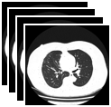
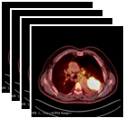

# 医疗大模型评测专项-胸外科医疗大模型评测
## 一、评测总体介绍

本次“北京市医疗大模型评测专项”以胸外科真实临床场景为核心，由国内胸外科院士团队牵头设计，依托权威指南、真实临床病例、多模态医学图像与开放式场景任务组成的高质量评测数据集，对大模型进行体系化、量化、可复现的胸外科能力测试。

评测体系基于 “三大场景 × 九大能力维度”：
|场景|能力|
|-|-|
|医学询证与知识|专科基础能力|
||专科科普能力|
|医学合规伦理|医学合规能力|
|专科诊疗决策|影像推理与质控能力|
||病理推理与质控能力|
||专科辅助诊断能力|
||专科辅助治疗能力|
||专科专病随访能力|
||专科专病预后分析能力|

评测结果将形成：基于评测结果，得到的模型或应用的能力报告

## 二、评测流程

以下为评测平台对参评模型执行的完整技术流程，适用于 **API 接入方式、网页端客户端方式、驻场测试方式**。


  - 客户端入口地址、测试账号、登录方式、使用指南  
- 双方确认评测使用的模型版本、推理参数（temperature、max_tokens 等）并冻结  
---

### 2.1 确认参评方式（API/网页端/驻场测试）
- 确认参评机构采用的接入方式：  
  - **API 接入评测**（优先推荐）  
  - **网页端/客户端接入评测**
  - **驻场测试**（适用于医院）  
- 参评机构需提交必要的接入信息：  
  - **API 接入测试需提交：**  
    - 最小可运行的样例调用代码（Python）  
    - 支持的模型参数说明（temperature / top_p / max_tokens 等）  
    - 多模态必须说明图像编码格式（Base64 / URL / 自定义字段）  
    - 若需导入第三方库，请说明**库名称与版本号**（如 `openai==1.52.0` 或 `requests==2.31.0`）  
    - 示例样例调用代码：
    - #### ✅（一）单模态文本对话 API 样例（必须提供）
    - #### ✅ Python 示例（建议官方 OpenAI SDK 格式）
	- > **如果使用第三方库，请注明版本，例如：**  
	- > `openai==1.52.0`  

        ```python
        import json
        from openai import OpenAI

        API_KEY = "xxxxxx"
        BASE_URL = "https://your_api_host/v1"
        MODEL   = "your_model_name"
        client = OpenAI(api_key=API_KEY, base_url=BASE_URL)
        question = "请回答：1+1等于几？（连通性测试示例）"

        completion = client.chat.completions.create(
            model=MODEL,
            temperature=0.2,
            max_tokens=256,
            messages=[
                {"role": "user", "content": question}
            ]
        )

        resp = json.loads(completion.model_dump_json())
        print(resp["choices"][0]["message"]["content"])
        ```
        - #### ✅（二）多模态输入 API 样例（以Base64为例）
        ```python
        import base64
        import json
        from openai import OpenAI
        from PIL import Image  # Pillow==10.2.0
        import io

        API_KEY = "xxxxxx"
        BASE_URL = "https://your_api_host/v1"
        MODEL   = "your_multimodal_model"

        # 读取本地图片并转为 Base64
        def encode_image_to_base64(path):
            with Image.open(path) as img:
                buffer = io.BytesIO()
                img.save(buffer, format=img.format)
                img_bytes = buffer.getvalue()
            return base64.b64encode(img_bytes).decode("utf-8")

        image_b64 = encode_image_to_base64("sample_ct_image.png")

        client = OpenAI(api_key=API_KEY, base_url=BASE_URL)

        prompt = "请根据图像描述该肺部病灶的影像特征。（测试用）"

        completion = client.chat.completions.create(
            model=MODEL,
            temperature=0.2,
            max_tokens=512,
            messages=[
                {"role": "user", 
                 "content": [
                    {"type": "text", "text": prompt},
                    {"type": "image_url", 
                     "image_url": {
                        "url": f"data:image/png;base64,{image_b64}"
                     }
                    }
                 ]}
            ]
        )

        resp = json.loads(completion.model_dump_json())
        print(resp["choices"][0]["message"]["content"])

  - **网页端/客户端接入评测需提交：**
    1. **· 公网可访问的网页端/客户端入口链接**  
       - 若需 VPN 或特定网络环境，需提供详细说明  
    2. **· 评测专用账号**  
       - 账号权限必须包含：提问、上传（如有）、导出、历史记录查询  
    3. **· 网页端功能说明**  
       - 是否支持文件上传（图片、PDF、结构化文件等）  
    5. **· 模型版本与参数固定策略**  
       - 明确用于评测的模型版本 
       - 固定参数（temperature 等）  

  - **驻场测试需提交：**
    1. **· 测试地点与地址信息**  
       - 科室名称、楼层、进入条件（门禁 / 登记流程）  
    2. **· 模型使用路径与操作流程说明**  
       - 是否为独立网页或客户端
       - 是否支持题目导入或完全依赖手工输入  
    3. **· 评测可用时间段**  
       - 提供现场联系人及电话
---


### 2.2 连通性测试
- 使用 **5–10 道样例题**（不包含正式评测题目）进行链路测试  
- 验证 API 或网页端的稳定性：  
  - 请求是否成功
  - JSON 响应结构是否符合样例规范  
- 网页端需验证输入框、提交按钮、对话窗口、文件上传（如有）等可用性  
- 连通性测试通过后方可进入全量评测阶段
---

### 2.3 模型评测
- **对参评模型推送本次评测的完整题集**：  
  - 单选题、多选题  
  - 开放式问答题  
  - 多模态问答题（CT / PET / 病理图像等）  
- **对所有模型回答进行统一格式化处理**：  
  - 抽取选择题选项字母（A/B/C/D）  
  - 清洗 Markdown/HTML 片段  
  - 统一编码、统一换行格式  
- **格式化后的结果进入评分模块**

---

### 2.4 评分与复核
- **选择题评分：**  
  - 单选题：完全匹配得分  
  - 多选题：漏选、多选均判错  
- **开放式问答评分：**  
  - 使用胸外科专科裁判模型对每个评分点逐项比对  
  - 自动生成 `obtained_score` 与 `scoring_flags`
- **危险建议扣分：**  
  - 若模型生成违背指南、违反伦理或带来安全风险的建议，将触发扣分机制  
- **专家抽审：**  
  - 北大人民医院胸外科专家组对推理类、决策类题目进行抽样审核  
  - 对模型错误或裁判模型边界情况进行医学纠偏  
- **场景 / 维度聚合：**  
  - 按“三大场景 × 九大能力维度”聚合得分  
---

## 三、评测数据集

样例题展示（选择题 / 文本问答 / 多模态问答）

**题型1：选择题**

题目：  
关于盘状肺不张的发生与预防，下列哪些表述正确?

A. 盘状肺不张的重要因素是肺泡丧失张力

B. 呼气末气道压力调为0.98kPa可避免盘状肺不张

C. ...

---

**题型2：文本问答题**

题目：  
According to the NCCN Guidelines (Version 1.2026), what are the treatment options for patients with stage I–IIA small cell lung cancer (SCLC), and how does the approach differ between operable and medically inoperable patients?

评分要点：
1. Mentions surgery as an option for resectable stage I–IIA SCLC.
2. Mentions requirement for multidisciplinary evaluation before surgery.
3. ...

---

**题型3：多模态病例推理题**

📝 病例描述

患者 5 个月前因 CEA 升高（270ng/ml）行胸部 CT（dicom-2023年12月胸部 CT 平扫）示：  
进一步完善 PET-CT，显示右肺中上叶体积缩小，……

📁 多模态影像

 

题目：患者诊断为 ERBB2 20ins 突变的 PD-L1 表达为 2%，更换治疗方案为德曲妥单抗的支持是什么？

评分要点：
1. 德曲妥单抗用于局部进展期肺癌有病例证据；
2. IIIA 期 NSCLC，使用德曲妥单抗新辅助治疗3周期后影像学PR；
3. ...

---

### 多模态题中非文本类数据格式说明

| 数据类型           | 格式       | 说明 |
|--------------------|------------|------|
| 病理图像           | JPG / JPEG | 已脱敏，单张或多张 |
| CT 原始序列        | NIfTI (.nii) | 包含非增强/增强 CT |
| PET 序列           | NIfTI (.nii) | 提供 SUV 信息 |

### 本次评测数据集

题目类型分布如下：
| 题型类别           | 占比 |
|--------------------|------|
| 选择题             | 65.6% |
| 文本问答题| 17.2%   |
| 多模态问答题       | 17.2%   |
| **总计**         |  100% |
